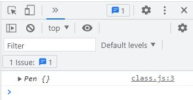
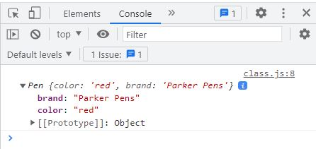
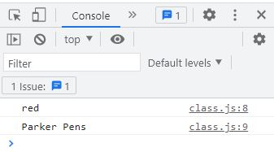
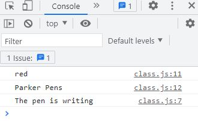
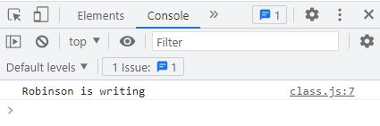

# Classes in JS

JavaScript class names starts with **capital letter** and should be **Pascal case** (first letter must be capital letter and no space between them. Example: JavaScript, BluePen, RedCode). Let's create a class called **Pen** using the **class** keyword.

```
// An empty class named Pen
class Pen {}
```

Well, its an empty class without any property. We will handle that later. First create an **object** of that class with the **new** keyword. To give a meaningful name we call it **pen**. Also noticed that pen is a variable of constant type. That's why we used **const** keyword before pen.

```
// new keyword creates a Pen object and sotres it in the pen variable.
const pen = new Pen();
```

Why create object? because, in real life everything is recognized as different objects. Pen, Eraser, Books, Pencil, Box all are different objects with different properties/characteristics. In coding, we can implement this same theory of objects and use them as reusable piece of code.&#x20;

Print out the object that we have created  in our browser console.

```
class Pen {}
const pen = new Pen();

// To display the pen object 
console.log(pen);
```



We need to think that what does it mean to be a pen. What type of features a pen should have.

To add property to the object we need to setup its property to the class first. Constructor function can do the work for us.

```
class Pen {
// Setups for object creation
  constructor() {
    this.color = "red";
    this.brand = "Parker Pens";
  }
}

// Creates object
const pen = new Pen();

// Displays output 
console.log(pen);
```

Here **this** keyword is used to reference the object that will be created (our pen object) when the constructor is initialized. We set two properties: **color** and **brand** of the pen. Its like specifying the data. So we **encapsulated** everything of an object inside a class. Now look at the output.



> #### Here it is! We created an object from a class which contains all the property from that class.&#x20;

Also there is a default property called Prototype that we will experiment later.

Using dot notation we can access single property of an object.

```
console.log(pen.color);
console.log(pen.brand);
```



Try to add a method to the class. Let me tell you that, there is a difference between **method** and **function**. We will cover that later. Now declare and define a **method** named write. For simplicity this method will just print out a string. Using dot notation we can access the method inside that class.

```
class Pen {
  constructor() {
    this.color = "red";
    this.brand = "Parker Pens";
  }
  // Method to display a string 
  write() {
    console.log("The pen is writing");
  }
}
const pen = new Pen();
console.log(pen.color);
console.log(pen.brand);
pen.write();
```



Also we can pass values in method by **arguments**. Used **\`\`** to make the string **dynamic** so the value can be inserted into **${ }**.

```
class Pen {
  constructor() {
    this.color = "red";
    this.brand = "Parker Pens";
  }
  // takes x value as argument and pass it to the string
  write(x) {
    console.log(`${x} is writing`);
  }
}
const pen = new Pen();
pen.write("Robinson");
```

The string "Robinson" is passed as argument inside write() method and it consoled out the string with our string value.


